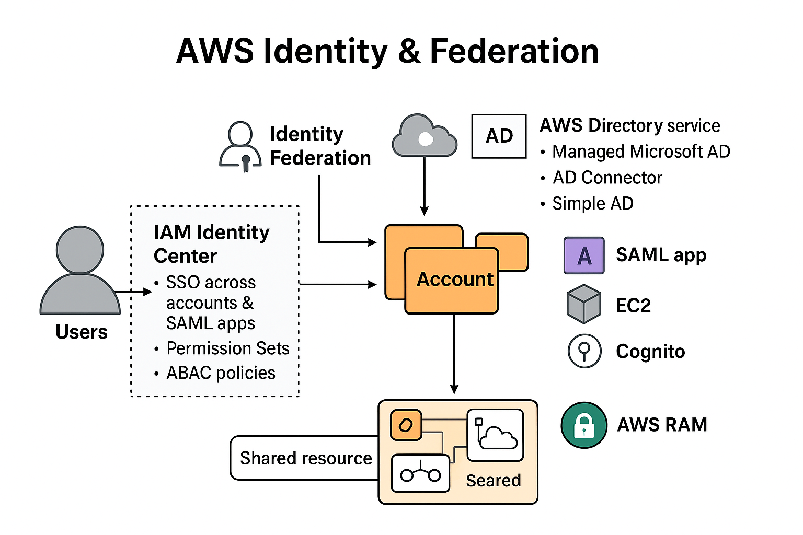

# AWS Identity & Federation - High-Level Summary

📍 Business Requirement:
- Securely manage users, identities, and access across multiple AWS accounts
- Enable single sign-on (SSO) for internal and external users
- Integrate on-premises identity systems with AWS resources
- Share resources efficiently across accounts without duplication

📦 Components:
| Component | Why |
|-----------|-----|
| **AWS Organizations** | Centralized multi-account management, consolidated billing, policy enforcement |
| **AWS Control Tower** | Automated setup of secure multi-account environment with best-practice guardrails |
| **IAM Identity Center** | Single login for multiple AWS accounts & SAML apps; manage Permission Sets and ABAC policies |
| **AWS Directory Service** | Managed Microsoft AD (standalone or with trust), AD Connector (proxy to on-premises AD), Simple AD (basic AD-compatible directory) |
| **STS (Security Token Service)** | Temporary credentials for assuming roles and federating access across accounts and apps |
| **Identity Federation** | SAML 2.0, custom IdP (GetFederationToken), Web Identity Federation (with/without Cognito) for external users |
| **AWS RAM (Resource Access Manager)** | Share VPC subnets, Transit Gateways, and other AWS resources across accounts within Organization |

💣 Failure Modes:
- Misconfigured trust relationships or roles → access denied or excessive permissions
- Federation token expiry or mismanagement → temporary credential loss
- Multi-account resources shared incorrectly → security or connectivity issues
- Misapplied guardrails / SCPs → compliance violations

🌍 DR Strategy (RTO/RPO):
- Cross-region replication of critical identity services (Managed AD, Cognito)
- Backup of IAM policies, permission sets, and Directory Service snapshots
- Testing failover and trust validation between on-premises and AWS

🎭 Trade-offs:
- STS temporary credentials → secure but short-lived
- AD Connector → no local caching, requires on-premises connectivity
- Simple AD → cost-effective but limited features (no MFA, no RDS integration)
- Web Identity Federation without Cognito → not recommended; Cognito preferred
- Resource sharing (RAM) → simplifies infra but introduces governance complexity

Whiteboard prompt:
> Multi-account AWS environment: Users log in via IAM Identity Center → access assigned accounts and apps based on Permission Sets → Shared VPC subnet via RAM for app interconnectivity → Managed AD provides identity services with optional trust to on-premises AD → STS issues temporary credentials for cross-account roles → Cognito handles web/mobile federation with MFA and anonymous support.

---

### 🧠 Key Notes / Exam Learnings
```md
- AWS Organizations: centralized multi-account management & consolidated billing
- AWS Control Tower: automated account creation, guardrails, compliance
- IAM Identity Center: SSO across AWS accounts & SAML apps, ABAC & Permission Sets
- STS: temporary credentials for AssumeRole, GetFederationToken, WebIdentity
- Identity Federation options:
  - SAML 2.0 (corporate IdP, ADFS)
  - Custom IdP (GetFederationToken)
  - Web Identity (Cognito recommended)
- Directory Service:
  - Managed Microsoft AD (multi-AZ, seamless join, RDS integration)
  - AD Connector (proxy to on-prem)
  - Simple AD (low-cost, basic AD-compatible)
- AWS RAM: share VPC subnets, Transit Gateways, Route53 rules across accounts
- Guardrails & SCPs enforce policies & restrict permissions centrally
```



